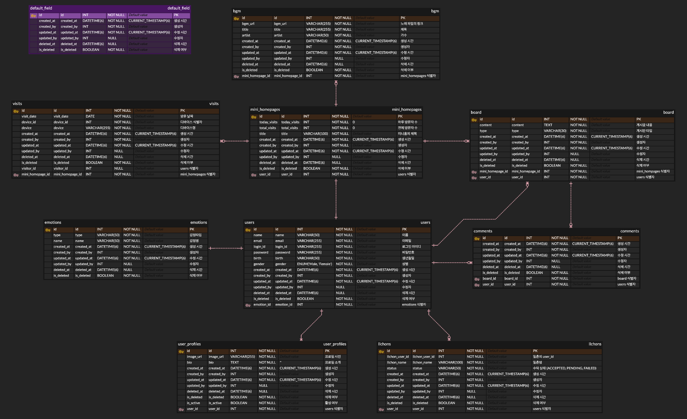

# 싸이월드

추억이 담긴 싸이월드의 향수를 다시 불러 일으키고 싶어 시작한 프로젝트 입니다.

 

---

### 기술 스택 (Tech Stack)

#### Backend

    
    
    
    
    

#### Frontend

    
    
    

#### Deployment & Infra

    
    

 

---

### 테이블 설계 (Database Schema)

  
ERD 보기 (Click to expand)

  

 

---

### 시스템 아키텍처 (System Architecture)
- 업데이트 예정

 

---

### 주요 기능 (Features) 25.08.09

- [x] 회원 관리: 회원가입, JWT 기반 로그인/로그아웃, Spring Security를 이용한 인증/인가
- [x] 미니홈피: 개인화된 프로필, 오늘의 감정, 방문자 수(Today/Total) 자동 집계 및 스케줄링을 통한 초기화
- [x] 일촌 관리: 일촌 신청/수락/거절/취소, 관계 끊기, 받은/보낸 신청 목록 조회, 일촌명 등 쌍방 관계 관리
- [x] 게시판 (방명록/다이어리/일촌평): 타입별 게시글 CRUD, 페이징 및 주인장/일촌별 상세 권한 관리
- [ ] 사진첩: 사진 업로드 및 앨범 관리 기능
- [ ] BGM: 미니홈피 배경음악 설정 및 재생 기능 구현
- [ ] 프론트엔드 연동: 개발된 백엔드 API와 프론트엔드 서버를 연동하여 실제 서비스 화면 구현
- [ ] 배포: AWS EC2, RDS 등 클라우드 환경에 프로젝트를 배포하여 실제 서비스 운영
