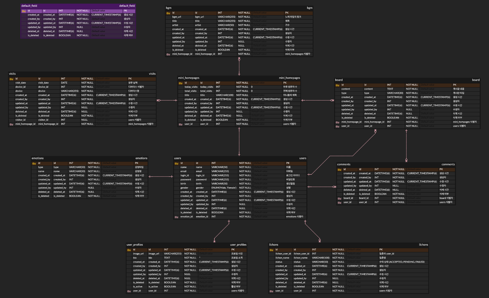

# 싸이월드

추억이 담긴 싸이월드의 향수를 다시 불러 일으키고 싶어 시작한 프로젝트 입니다.

 

---

### 기술 스택 (Tech Stack)

#### Backend

    
    
    
    
    

#### Frontend

    
    
    

#### Deployment & Infra

    
    

 

---

### 테이블 설계 (Database Schema)

  
ERD 보기 (Click to expand)

  

 

---

### 시스템 아키텍처 (System Architecture)
- 업데이트 예정

 

---

### 주요 기능 (Features) 25.08.08

- [ ] 회원 관리: 회원가입, 로그인, 정보 수정 기능
- [x] 미니홈피: 개인화된 프로필, 상태메시지, 프로필 사진 관리
- [ ] 일촌 관리: 일촌 신청, 수락, 끊기 및 일촌명 설정
- [x] 방명록: 다른 회원의 미니홈피에 글 작성 및 비밀글 기능
- [ ] 사진첩: 사진 업로드 및 앨범 관리 기능
